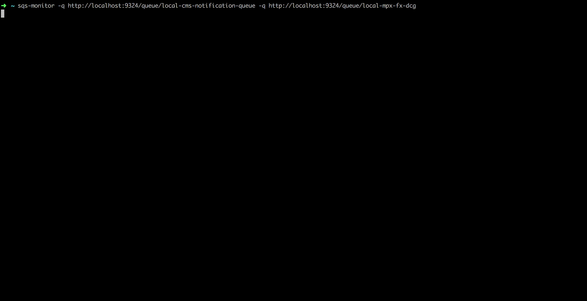

# SQSMonitor

Plot a graph of approximate messages number in SQS queue(s) in terminal.
Useful for watching load on SQS/ElasticMQ



## Installation


```
npm -g install @mprokopowicz/sqs-monitor
```

or

```
yarn global add @mprokopowicz/sqs-monitor
```

## AWS Credentials and Region

Set following ENV variables

```
export AWS_ACCESS_KEY_ID=foo
export AWS_SECRET_ACCESS_KEY=bar
export AWS_REGION=us-east-2
```

## Usage

```
> sqs-monitor -q http://localhost:9324/queue/queue1 -q http://localhost:9324/queue/queue2
```

### Options

#### q - queue
required - queue url for watch, you can put as many -q args as you wish

#### i - interval
refresh interval in seconds, 1s by default
